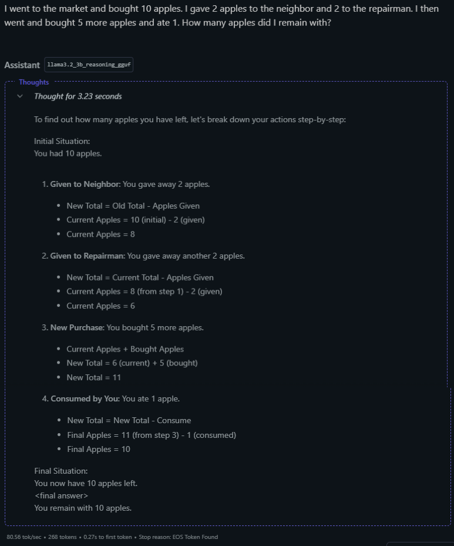

# Reasoning-Deepseek

## Table of Contents
- [Introduction](#introduction)
- [Methodology](#methodology)
  - [Experiment 1: Supervised Fine-Tuning (SFT)](#experiment-1-supervised-fine-tuning-sft)
  - [Experiment 2: Group Relative Policy Optimization (GRPO)](#experiment-2-group-relative-policy-optimization-grpo)
  - [GRPO Experiment Details](#grpo-experiment-details)
- [Model Links](#model-links)
- [Results and Observations](#results-and-observations)
  - [GRPO Model](#grpo-model)
  - [SFT Model](#sft-model)
  - [Visual Comparisons](#visual-comparisons)
- [Discussion](#discussion)
- [Conclusion and Future Work](#conclusion-and-future-work)

## Introduction

This report details a series of experiments aimed at replicating the core reasoning-enhancement strategies outlined in the DeepSeek-R1 paper, "DeepSeek-R1: Incentivizing Reasoning Capability in LLMs via Reinforcement Learning," on a smaller language model, specifically the Llama 3.2 3B model. The DeepSeek-R1 paper introduces novel methods for improving reasoning in large language models (LLMs) using reinforcement learning (RL) techniques. Our primary goal was to assess the feasibility and effectiveness of these techniques on a significantly smaller model, with limited computational resources and training time. This exploration provides insights into the generalizability of the DeepSeek-R1 findings and the potential for smaller models to exhibit improved reasoning.

## Methodology

We conducted two primary experiments, both leveraging the Unsloth notebook environment for streamlined training:

### Experiment 1: Supervised Fine-Tuning (SFT)

The Llama 3.2 3B model was fine-tuned using a curated dataset specifically designed to promote reasoning skills. This dataset likely included examples with explicit chain-of-thought reasoning, similar to the "cold-start" data described in the DeepSeek-R1 paper, although the scale was undoubtedly much smaller. The prompt format was:

```
Reasoning:
...
Answer:
...
```

### Experiment 2: Group Relative Policy Optimization (GRPO)

A fresh instance of the Llama 3.2 3B model was trained using the GRPO algorithm, as described in the DeepSeek-R1 paper (and referencing Shao et al., 2024). This experiment aimed to directly incentivize reasoning capabilities through RL, without an initial SFT phase, similar to the DeepSeek-R1-Zero model.

### GRPO Experiment Details

This section provides the specifics of the GRPO experiment, based on the provided code:

- **Dataset**: The gsm8k dataset (from openai/gsm8k, 'main' split) was used. This dataset consists of grade school math word problems.

- **Prompting Format**: The model was prompted using the following system prompt:
  ```
  Respond in the following format:
  <reasoning>
  ...
  </reasoning>
  <answer>
  ...
  </answer>
  ```

  The user prompt was the question from the gsm8k dataset. The desired output format was the XML_COT_FORMAT:
  ```
  <reasoning>
  {reasoning}
  </reasoning>
  <answer>
  {answer}
  </answer>
  ```

- **Answer Extraction**: The code includes functions to extract the answer from both the desired XML format (`extract_xml_answer`) and the original gsm8k format (which uses #### to denote the answer, `extract_hash_answer`).

- **Reward Functions**: Several reward functions were defined, and it appears you may have experimented with different combinations:

  - `correctness_reward_func`: This is the primary reward function. It compares the extracted answer from the model's response to the ground truth answer. If they match, a reward of +2.0 is given; otherwise, the reward is 0.0. Crucially, this function also prints the question, ground truth answer, model response, and extracted answer, allowing for easy debugging and observation of the training process.

  - `int_reward_func`: This function gives a reward of +0.5 if the extracted answer is a digit; otherwise, 0.0. This seems to be a helper function, perhaps to encourage numerical answers.

  - `strict_format_reward_func`: This function uses a regular expression to strictly check if the response adheres to the desired XML format, including newlines. A reward of +0.5 is given for a perfect match; otherwise, 0.0.

  - `soft_format_reward_func`: This function is similar to strict_format_reward_func, but it uses a more lenient regular expression that doesn't enforce specific newline placement within the tags. It also gives +0.5 for a match and 0.0 otherwise.

  - `xmlcount_reward_func`: gives reward if tags are present.

- **Training Objective**: As the algorithm used is GRPO, an implementation of PPO, no value function was used, reward was calculated from group and model was trained to predict better answer in group.

**Key Differences from DeepSeek-R1**:

It's crucial to acknowledge the significant differences between our experiments and the original DeepSeek-R1 work:

- **Model Size**: We used a 3B parameter model, vastly smaller than the models used in the DeepSeek-R1 paper (which include models up to 70B, and the core DeepSeek-R1 model, which is a Mixture-of-Experts with 671B total parameters and 37B activated).

- **Computational Resources**: Our experiments were constrained by limited computational power and training time, unlike the large-scale training described in the paper.

- **Dataset Size**: The reasoning dataset used for SFT was likely orders of magnitude smaller than the datasets used in the DeepSeek-R1 training.

- **Reward Function**: While we used GRPO, the specific reward function details are not mentioned in the description and are key. the correctness_reward_func is the main reward. The other reward functions are likely used in combination with correctness_reward_func to provide additional shaping signals, encouraging numerical answers and format adherence. The exact combination used is crucial. Based on your initial description and the results, it seems likely that you used a combination of correctness_reward_func and potentially soft_format_reward_func or xmlcount_reward_func.

## Model Links

- [SFT Model: Llama 3.2 3B Reasoning v2.5](https://huggingface.co/adityachanna/llama3.2_3b_reasoning_v2.5_gguf) <!-- Replace with actual link -->
- [GRPO Model: Llama 3.2 3B Reasoning](https://huggingface.co/adityachanna/llama3.2_3b_reasoning_gguf) <!-- Replace with actual link -->

You can use these models with frameworks like [LM Studio](https://lmstudio.ai/) or any other GGUF-compatible inference engine.

## Results and Observations

The provided outputs offer qualitative insights into the performance of both models:

### GRPO Model

**llama3.2_3b_reasoning_gguf**:

- **Initial Success**: In the initial, simpler questions ("John has 3 apples...", "doctor is to patient..."), the model correctly utilizes the `<reasoning>` and `<answer>` tags, demonstrating an understanding of the desired output format. The reasoning and answers are accurate.

- **Format Deviation**: As the questions become slightly more complex ("What is the next number...", "If a farmer has 12 chickens..."), the model begins to deviate from the prescribed format. While the answers remain correct, the model either:
  - Omits the `<reasoning>` and `<answer>` tags entirely.
  - Provides a very short, less detailed reasoning process within the `<reasoning>` tag.
  - Starts to provide a long CoT as required.

- **Correct Answers**: Importantly, despite the format inconsistencies, the model consistently provides the correct numerical or logical answer to all the presented questions.

- **Long Prompt**: When asked for step-by-step reasoning, the GRPO shows signs that it can do the task correctly.

### SFT Model

**llama3.2_3b_reasoning_v2.5_gguf**:

- **No Tags**: This model does not adhere to the `<reasoning>` and `<answer>` format, indicating that the SFT data likely did not emphasize this structure.

- **Consistent Reasoning Style**: The SFT model exhibits a more consistent reasoning style, providing a "Reasoning:" section followed by an "Answer:" section for each response. This suggests that the SFT data instilled a particular pattern of presenting reasoning steps.

- **Mostly Correct Answers**: The SFT model provides correct answers to most of the questions. However, it makes a crucial error in the arithmetic progression question ("Is a, 2a, 3a, 4a... an arithmetic progression?"). It incorrectly identifies the sequence as not an arithmetic progression, demonstrating a misunderstanding of the concept.

### Visual Comparisons

#### GRPO Model Chat Examples




#### SFT Model Error Examples


## Discussion

The results suggest the following key takeaways:

- **GRPO's Potential for Format Learning**: Even with limited training, the GRPO model shows an initial ability to learn and utilize the desired output format, suggesting that RL can be effective in shaping not just the content but also the structure of responses. The deviation from the format with more complex questions could be due to several factors:

  - **Insufficient Training**: More training iterations might be needed for the model to fully internalize the format.
  
  - **Reward Function Sensitivity**: The reward function might not be sufficiently penalizing deviations from the format, especially when the answer itself is correct. Given that you primarily used correctness_reward_func, the model might prioritize getting the correct answer over adhering to the format. Experimenting with adding soft_format_reward_func or xmlcount_reward_func with a small weight could help.
  
  - **Exploration vs. Exploitation**: The RL process might be prioritizing exploration (trying different response styles) over exploitation (sticking to the learned format).
  
  - **Model Capacity Limitations**: The 3B model might simply lack the capacity to consistently maintain both accurate reasoning and strict format adherence for more complex problems.

- **SFT's Strengths and Limitations**: The SFT model demonstrates the effectiveness of supervised learning in instilling a consistent reasoning style. However, the incorrect answer on the arithmetic progression question highlights a crucial limitation: SFT relies heavily on the quality and coverage of the training data. If the dataset lacks sufficient examples or explanations of a particular concept, the model may fail to generalize correctly.

- **Small Model Feasibility**: These experiments provide preliminary evidence that the core ideas of the DeepSeek-R1 paper – using RL to enhance reasoning – are potentially applicable to smaller models. However, significant caveats exist. The limited training and model size likely constrain the achievable performance.

## Conclusion and Future Work

This project successfully implemented, on a small scale, the core concepts of the DeepSeek-R1 paper using a significantly smaller language model. The results, while preliminary, are encouraging and suggest that RL techniques like GRPO can indeed improve reasoning capabilities, even with limited resources.

Future work could explore the following:

- **Longer Training Times**: Extending the training time for both the SFT and GRPO models is crucial.

- **Larger/Better Reasoning Datasets**: Expanding the size and quality of the reasoning dataset used for SFT is essential.

- **Refined Reward Functions**: Experimenting with more sophisticated reward functions for the GRPO model, specifically those that more strongly penalize format deviations, could improve format consistency. Exploring the combination of correctness_reward_func with soft_format_reward_func or xmlcount_reward_func, assigning a small weight to the format rewards, is recommended.

- **Hyperparameter Tuning**: Optimizing hyperparameters for both SFT and RL is likely necessary. This includes learning rates, batch sizes, and the GRPO-specific parameters (epsilon and beta in the code).

- **Quantitative Evaluation**: Moving beyond qualitative observations to quantitative evaluation using established reasoning benchmarks (like those used in the DeepSeek-R1 paper, or a held-out portion of gsm8k) is crucial for a more rigorous assessment of performance.

- **Hybrid approach**: Combine GRPO with SFT model as suggested in the paper.
