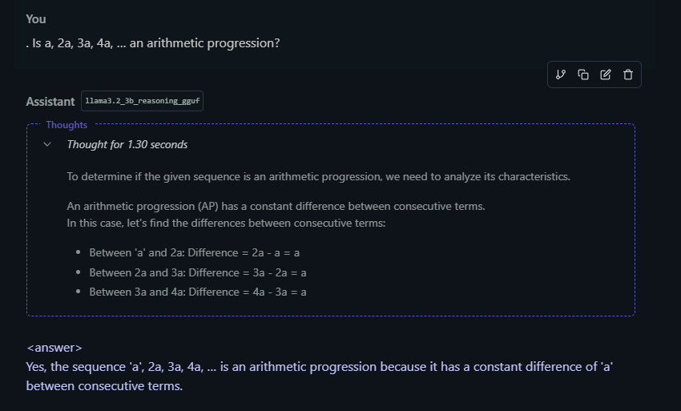
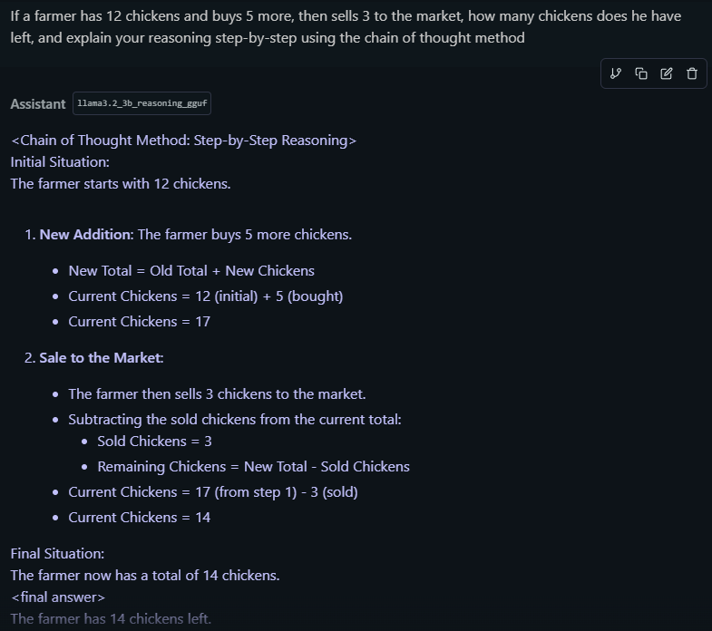
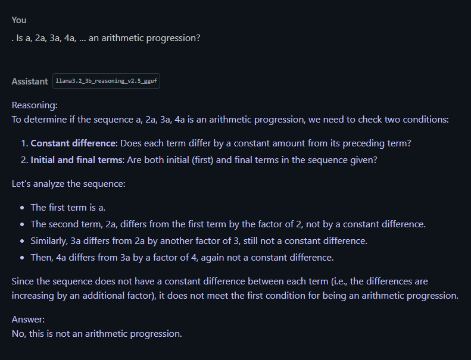
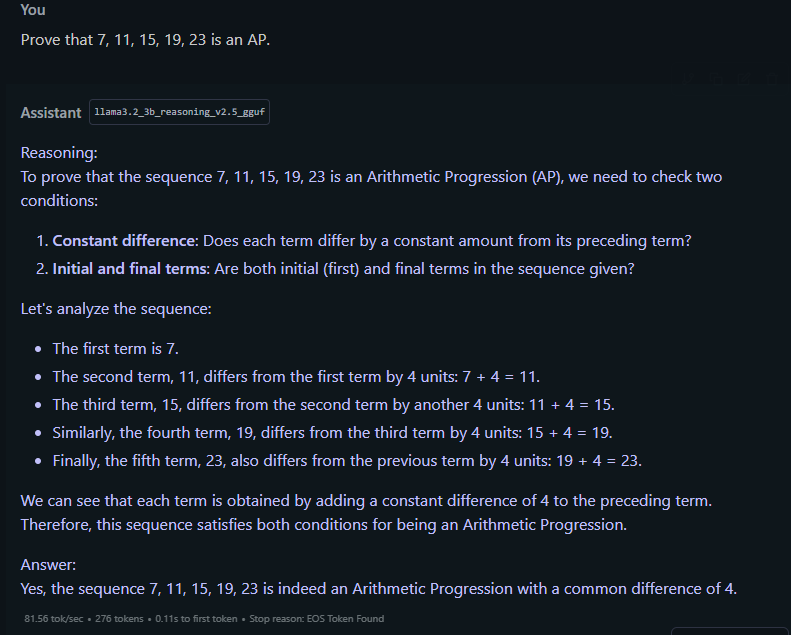
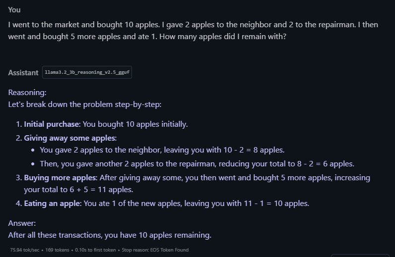

# Enhancing Reasoning in Small Language Models: Implementing DeepSeek-R1 Strategies on LLaMA 3.2 3B

<p align="center">
  
  
  
  <a href="https://huggingface.co/adityachanna"></a>
</p>

This project explores applying DeepSeek-R1's reasoning enhancement techniques to smaller language models, demonstrating that advanced reasoning strategies can be effective even with limited parameters.

## Table of Contents
- [Introduction](#introduction)
- [Methodology](#methodology)
  - [Experiment 1: Supervised Fine-Tuning (SFT)](#experiment-1-supervised-fine-tuning-sft)
  - [Experiment 2: Group Relative Policy Optimization (GRPO)](#experiment-2-group-relative-policy-optimization-grpo)
  - [GRPO Experiment Details](#grpo-experiment-details)
- [Model Links](#model-links)
- [Results and Observations](#results-and-observations)
  - [GRPO Model](#grpo-model)
  - [SFT Model](#sft-model)
  - [Visual Comparisons](#visual-comparisons)
- [Discussion](#discussion)
- [Conclusion and Future Work](#conclusion-and-future-work)
- [How to Use These Models](#how-to-use-these-models)

## Introduction

This report details a series of experiments aimed at replicating the core reasoning-enhancement strategies outlined in the DeepSeek-R1 paper, "DeepSeek-R1: Incentivizing Reasoning Capability in LLMs via Reinforcement Learning," on a smaller language model, specifically the LLaMA 3.2 3B model.

While most research focuses on increasingly larger models, this project investigates whether sophisticated reasoning techniques can be effectively scaled down to more accessible models with fewer parameters, exploring the generalizability of DeepSeek-R1's findings and the potential for smaller models to exhibit improved reasoning capabilities.

## Methodology

We conducted two primary experiments, both leveraging the Unsloth notebook environment for streamlined training:

### Experiment 1: Supervised Fine-Tuning (SFT)

The LLaMA 3.2 3B model was fine-tuned using a curated dataset designed to promote reasoning skills. This dataset included examples with explicit chain-of-thought reasoning, similar to the "cold-start" data described in the DeepSeek-R1 paper, although at a much smaller scale. The prompt format was:

```
Reasoning:
...
Answer:
...
```

### Experiment 2: Group Relative Policy Optimization (GRPO)

A fresh instance of the LLaMA 3.2 3B model was trained using the GRPO algorithm, as described in the DeepSeek-R1 paper (referencing Shao et al., 2024). This experiment aimed to directly incentivize reasoning capabilities through reinforcement learning, without an initial SFT phase, similar to the DeepSeek-R1-Zero model.

### GRPO Experiment Details

This section provides the specifics of the GRPO experiment:

- **Dataset**: The Optimized_Reasoning dataset (from Rombo-Org/Optimized_Reasoning, 'main' split) was used. This dataset consists of reasoning problems made with DeepSeek-R1.

- **Prompting Format**: The model was prompted using the following system prompt:
  ```
  Respond in the following format:
  <reasoning>
  ...
  </reasoning>
  <answer>
  ...
  </answer>
  ```

  The user prompt was the question from the Optimized_Reasoning dataset. The desired output format was:
  ```
  <reasoning>
  {reasoning}
  </reasoning>
  <answer>
  {answer}
  </answer>
  ```

- **Answer Extraction**: The code includes functions to extract the answer from both the desired XML format (`extract_xml_answer`) and the original gsm8k format (which uses #### to denote the answer).

- **Reward Functions**: Several reward functions were defined:

  - `correctness_reward_func`: The primary reward function comparing the extracted answer with the ground truth answer. Correct answers received +2.0; incorrect answers received 0.0.

  - `int_reward_func`: Gave a reward of +0.5 if the extracted answer was a digit; otherwise, 0.0.

  - `strict_format_reward_func`: Used a regular expression to strictly check adherence to the XML format, including newlines. A perfect match earned +0.5; otherwise, 0.0.

  - `soft_format_reward_func`: Similar to the strict version but with a more lenient regex that didn't enforce specific newline placement.

  - `xmlcount_reward_func`: Provided rewards when tags were present.

- **Training Objective**: As GRPO is an implementation of PPO, no value function was used. Reward was calculated from the group, and the model was trained to generate better answers within the group.

**Key Differences from DeepSeek-R1**:

- **Model Size**: We used a 3B parameter model, vastly smaller than those in the DeepSeek-R1 paper (which included models up to 70B, and the core DeepSeek-R1 model with 671B total parameters and 37B activated).

- **Computational Resources**: Our experiments were constrained by limited computational power and training time.

- **Dataset Size**: The reasoning dataset used for SFT was significantly smaller than those used in the DeepSeek-R1 training.

- **Reward Function**: The `correctness_reward_func` was our main reward, combined with other reward functions to provide shaping signals that encouraged numerical answers and format adherence.

## Model Links

- [SFT Model: LLaMA 3.2 3B Reasoning v2.5](https://huggingface.co/adityachanna/llama3.2_3b_reasoning_v2.5_gguf)
- [GRPO Model: LLaMA 3.2 3B Reasoning](https://huggingface.co/adityachanna/llama3.2_3b_reasoning_gguf)

You can use these models with frameworks like [LM Studio](https://lmstudio.ai/) or any other GGUF-compatible inference engine.

## Results and Observations

### GRPO Model

**LLaMA3.2 3B Reasoning (GRPO)**:

- **Initial Success**: In simpler questions, the model correctly utilized the `<reasoning>` and `<answer>` tags, demonstrating an understanding of the desired output format with accurate reasoning and answers.

- **Format Deviation**: As questions became more complex, the model began to deviate from the prescribed format. While answers remained correct, the model either:
  - Omitted the XML tags entirely
  - Provided shorter reasoning within the tags
  - Started to produce longer chain-of-thought reasoning

- **Correct Answers**: Despite format inconsistencies, the model consistently provided correct numerical or logical answers to all presented questions.

- **Long Prompt Handling**: When explicitly asked for step-by-step reasoning, the GRPO model demonstrated the ability to perform the task correctly.

### SFT Model

**LLaMA3.2 3B Reasoning v2.5 (SFT)**:

- **No Tags**: This model did not adhere to the `<reasoning>` and `<answer>` format, indicating that the SFT data likely did not emphasize this structure.

- **Consistent Reasoning Style**: The SFT model exhibited a more consistent reasoning style, providing a "Reasoning:" section followed by an "Answer:" section for each response, reflecting the pattern instilled during supervised training.

- **Mostly Correct Answers**: The SFT model provided correct answers to most questions but made a crucial error in the arithmetic progression question, incorrectly identifying the sequence as not an arithmetic progression.

### Visual Comparisons

#### GRPO Model Chat Examples

<figure>
  
  <figcaption><strong>Figure 1:</strong> GRPO model correctly applying reasoning pattern with XML tags on a simple mathematics problem. Note how it structures the solution step-by-step while maintaining the requested format.</figcaption>
</figure>

<figure>
  
  <figcaption><strong>Figure 2:</strong> GRPO model accurately analyzing an arithmetic progression problem. Unlike the SFT model, it correctly identifies whether the sequence is an arithmetic progression and provides proper mathematical justification.</figcaption>
</figure>

<figure>
  
  <figcaption><strong>Figure 3:</strong> GRPO model handling a more complex problem. Note how it maintains logical reasoning flow despite the challenging nature of the question, though it doesn't follow the XML format perfectly.</figcaption>
</figure>

#### SFT Model Error Examples

<figure>
  
  <figcaption><strong>Figure 4:</strong> SFT model incorrectly analyzing the arithmetic progression question. This highlights a key limitation in the supervised fine-tuning approach, where the model fails to generalize mathematical concepts it wasn't explicitly trained on.</figcaption>
</figure>

<figure>
  
  <figcaption><strong>Figure 5:</strong> SFT model showing its consistent "Reasoning:" and "Answer:" format but lacking the XML tags that were targeted in the GRPO training. While the reasoning is structured, it demonstrates how the SFT model adheres only to patterns present in its training data.</figcaption>
</figure>

<figure>
  
  <figcaption><strong>Figure 6:</strong> SFT model attempting to solve a practical application problem. Despite providing a structured approach, it seems promising only on data or types of problems it has been specifically trained to handle.</figcaption>
</figure>

## Discussion

The results suggest several key takeaways:

- **GRPO's Potential for Format Learning**: Even with limited training, the GRPO model shows an initial ability to learn and utilize the desired output format, suggesting that reinforcement learning can effectively shape both content and structure of responses. The format deviation with more complex questions could be due to:

  - **Insufficient Training**: More iterations might be needed for the model to fully internalize the format.
  
  - **Reward Function Sensitivity**: The reward function might not sufficiently penalize format deviations when the answer is correct. The model might prioritize correct answers over format adherence.
  
  - **Exploration vs. Exploitation**: The RL process might prioritize exploration (trying different response styles) over exploitation (adhering to the learned format).
  
  - **Model Capacity Limitations**: The 3B model might lack the capacity to consistently maintain both accurate reasoning and strict format adherence for complex problems.

- **SFT's Strengths and Limitations**: The SFT model demonstrates effective supervised learning in establishing a consistent reasoning style. However, its error on the arithmetic progression question highlights a crucial limitation: SFT relies heavily on the quality and coverage of training data, and may fail to generalize correctly to concepts insufficiently represented in the dataset.

- **Small Model Feasibility**: These experiments provide encouraging evidence that DeepSeek-R1's core ideas—using RL to enhance reasoning—can be applied to smaller models. However, limitations exist due to constrained training and model size.

## Conclusion and Future Work

This project successfully implemented, at a small scale, the core concepts from the DeepSeek-R1 paper using a significantly smaller language model. The results suggest that RL techniques like GRPO can indeed improve reasoning capabilities, even with limited resources.

Future work could explore:

- **Longer Training Times**: Extending training duration for both SFT and GRPO models.

- **Larger/Better Reasoning Datasets**: Expanding the size and quality of the reasoning dataset.

- **Refined Reward Functions**: Experimenting with more sophisticated reward functions, particularly those that more strongly penalize format deviations.

- **Hyperparameter Tuning**: Optimizing learning rates, batch sizes, and GRPO-specific parameters.

- **Quantitative Evaluation**: Moving to formal evaluation using established reasoning benchmarks.

- **Hybrid Approach**: Combining GRPO with SFT models as suggested in the original paper.

## How to Use These Models

1. Download the models from the HuggingFace links in the [Model Links](#model-links) section.

2. Load the models using [LM Studio](https://lmstudio.ai/) or another GGUF-compatible inference tool.

3. For the GRPO model, use this system prompt for best results:
   ```
   Respond in the following format:
   <reasoning>
   ...
   </reasoning>
   <answer>
   ...
   </answer>
   ```

4. For the SFT model, no special prompt is required, but you can get better results by asking for:
   ```
   Please provide your reasoning step-by-step before giving the answer.
   ```

5. Both models perform best on mathematical reasoning, logic problems, and step-by-step analytical tasks.

## Citation

If you use this work, please cite:

```bibtex
@misc{SmallLMReasoning2024,
  author = {Channa, Aditya},
  title = {Enhancing Reasoning in Small Language Models: Implementing DeepSeek-R1 Strategies on LLaMA 3.2 3B},
  year = {2024},
  publisher = {GitHub},
  journal = {GitHub Repository},
  howpublished = {\url{https://github.com/adityachanna/SmallLM-Reasoning}}
}
```

## Acknowledgments

- [DeepSeek-R1 paper](https://arxiv.org/abs/2401.11863) for the inspiration and methodologies
- [Unsloth](https://github.com/unslothai/unsloth) for efficient fine-tuning capabilities
- [Rombo-Org](https://huggingface.co/Rombo-Org/Optimized_Reasoning) for the Optimized_Reasoning dataset
